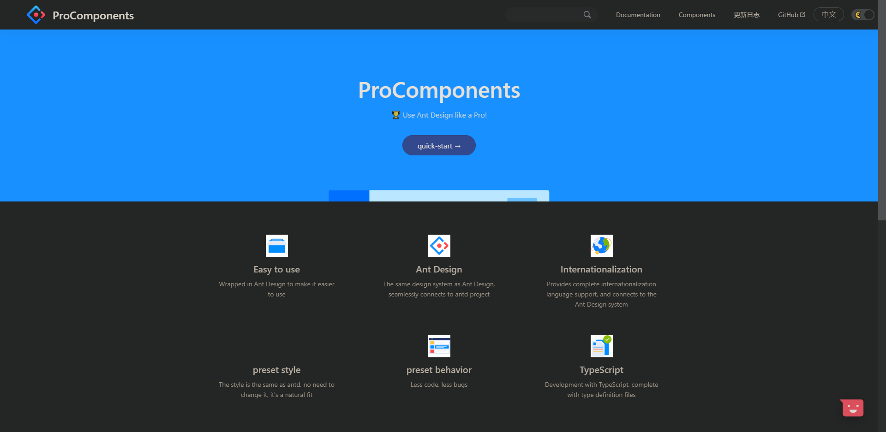

English | [简体中文](./README_cn-zh.md)

<p align="center">
  
</p>
<h1 align="center">React Darkreader</h1>

<p align="center">🌓 A React Hook for adding a dark / night mode to your site inspired by <a href="https://github.com/darkreader/darkreader" target="_blank">darkreader</a>
</p>

<p align="center">
  <a href="https://www.npmjs.com/package/react-darkreader" target="_blank"></a>  <a href="https://github.com/umijs/dumi" target="_blank"></a>  <a href="https://www.jsdelivr.com/package/npm/react-darkreader" target="_blank"></a>
</p>

<p align="center">Live Demo ✨ <a href="https://react-darkreader.vercel.app" target="_blank">https://react-darkreader.vercel.app</a></p>

## Getting Started

Install with yarn

```bash
yarn add react-darkreader
```

Or

```bash
npm install react-darkreader
```

Or inject the script at your page by [jsdelivr CDN](https://www.jsdelivr.com/)

```html
<script src="https://cdn.jsdelivr.net/npm/react-darkreader@latest/dist/index.min.js"></script>
```

## 🚀 Usage

For a simple light/dark switch, darkreader can be used as a component:

```tsx | pure
import React from 'react';
import Darkreader from 'react-darkreader';

export default () => <Darkreader />;
```

For a custom switch and/or following the system's preference, you can use the `useDarkreader` hook.

```tsx | pure
import React from 'react';
import { useDarkreader } from 'react-darkreader';

export default () => {
  const [isDark, { toggle }, mode] = useDarkreader(false);

  return (
    <>
      <CustomSwitch mode={mode} onChange={toggle} />
      <p>Current mode: {mode}</p>
      <p>Is dark: {isDark}</p>
    </>
  );
};
```

## 📔 API

### Component

```tsx | pure
<Darkreader
  defaultDarken
  theme={/** Theme options **/}
  fixes={/** Contains fixes for the generated theme **/}
  onChange={isDark => {
    /** Callback for change **/
  }}
/>
```

### Hook

```typescript
const [isDark, { toggle, setMode, collectCSS }, mode] = useDarkreader(
  defaultDarken,
  theme?,
  fixes?,
  allowSystem,
);
```

### Hook Result

| Return Value | Description                                             | Type                              |
| ------------ | ------------------------------------------------------- | --------------------------------- |
| `isDark`     | Whether the current mode is dark.                       | `boolean`                         |
| `action`     | Object containing darkmode control methods.             | `{ toggle, setMode, collectCSS }` |
| `mode`       | Current mode value: `'light'`, `'dark'`, or `'system'`. | `'light' \| 'dark' \| 'system'`   |

#### `action` methods

| Method       | Description                                              | Type                    |
| ------------ | -------------------------------------------------------- | ----------------------- |
| `toggle`     | Cycle through modes (`light → dark → (system) → light`). | `() => void`            |
| `setMode`    | Manually set mode (`'light'`, `'dark'`, `'system'`).     | `(mode: Mode) => void`  |
| `collectCSS` | Collect generated darkmode CSS asynchronously.           | `() => Promise<string>` |

### Parameters

| Param           | Description                                                                                                  | Type              | Default |
| --------------- | ------------------------------------------------------------------------------------------------------------ | ----------------- | ------- |
| `defaultDarken` | Initial darkmode status.                                                                                     | `boolean`         | `false` |
| `theme`         | Darkreader theme overrides. [Reference →](https://github.com/darkreader/darkreader/blob/main/index.d.ts#L41) | `Partial<Theme>`  | -       |
| `fixes`         | Fixes for generated theme. [Reference →](https://github.com/darkreader/darkreader/blob/main/index.d.ts#L121) | `DynamicThemeFix` | -       |
| `allowSystem`   | Whether to allow system color scheme (`prefers-color-scheme`) support.                                       | `boolean`         | `false` |

## 🔢 Coming Soon

- [x] Material design switch UI
- [x] `followSystemColorScheme`
- [x] `localStorage` persistence
- [ ] Online playground for theme config

## 🔨 Contribute

```bash
npm i
npm start      # Start dev server
npm run build  # Build library
npm run docs:build
```

## 🥇 Who is using

| [Ant Design Pro Components Light](https://procomponents.ant.design/) | [Ant Design Pro Components Dark](https://procomponents.ant.design/) |
| :------------------------------------------------------------------: | :-----------------------------------------------------------------: |
|         |          |

[More here &rarr;]() Welcome to submit.

## ❤️ Contributors

Thanks goes to these people:


Please Feel free to enjoy and participate in open source!

## ⭐ Stargazers

Thanks for your star!

[](https://github.com/Turkyden/react-darkreader/stargazers)

## ✨ Follow Me

这是作者的微信「视频号」，每天分享一些有趣的 SaaS 软件产品，欢迎关注 ~


## License

[MIT](https://github.com/Turkyden/react-darkreader/blob/main/LICENSE)
